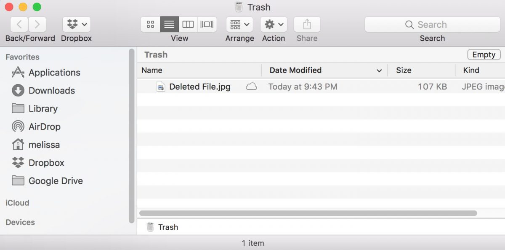
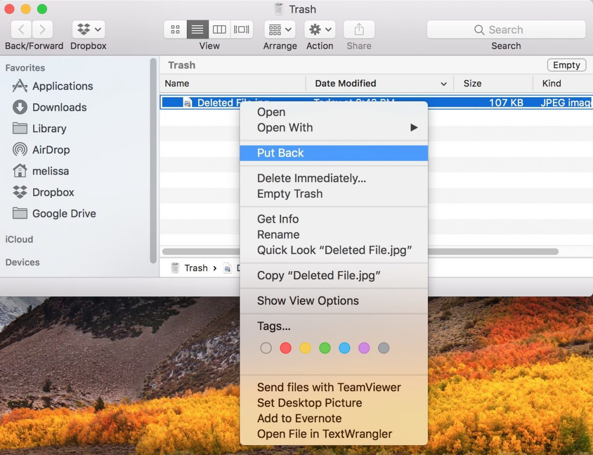
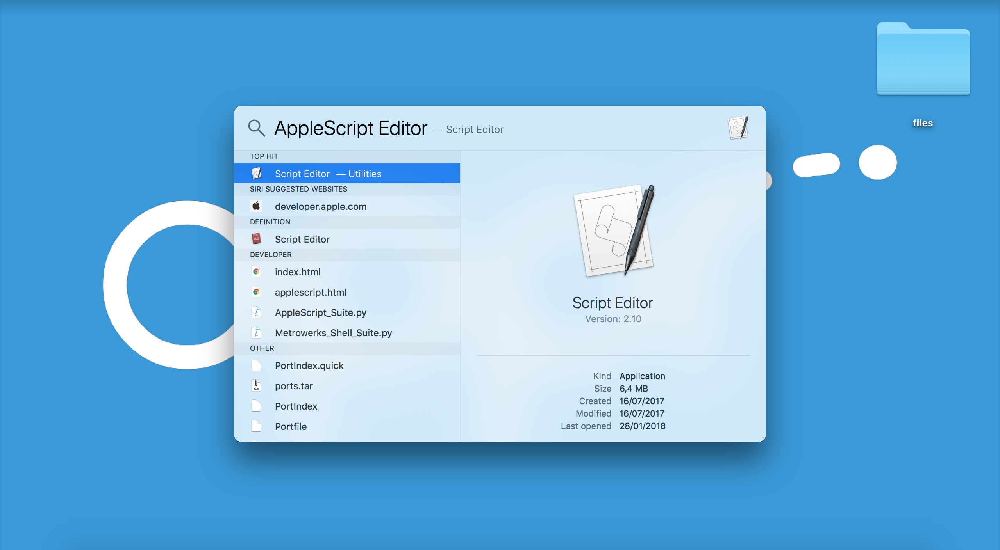
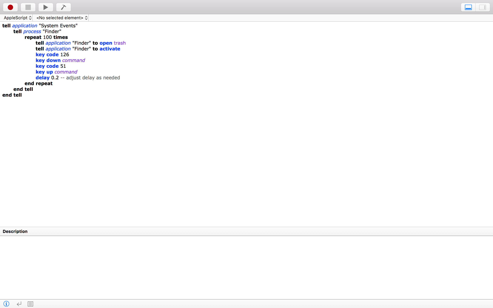

# Trash Back


When you [delete a file in MacOS](https://support.apple.com/kb/PH25075), its original locations is [stored](https://en.wikipedia.org/wiki/.DS_Store) in the `.DsStore` hidden files in case you want to restore it. Recent versions of macOS have the ability to put stuff in your Trash back where it came from, lickety-split, and it’s way faster than dragging and dropping. So as you know, if you click on the trash icon in your Dock, you will see the items you have, well, trashed. Right-click or Control-click on any file (or hold down Command to click and select multiple items, then Control-click), and you will see the **Put Back** option. The only problem is that it let us do it for only one item at the time. Motivated by this issues and thanks to [Giacomo Balli](http://giacomoballi.com/), we created this repository to help you.

## The Issue

To undrstand the issue we are talking about just follow the next figures.

1. Open the Trash.



2. Right-click on any file, and you’ll see the **Put Back** option.



3. Do this for each file you have.

As you can see you have the tremendeus tedeus solutions of clicking **Put Back** each time you want to put back a file. However, there is a smarter solution for it. Follow the next steps of this [README](https://github.com/opprDev/trash-back/blob/master/README.md) file.

## The Solution

The solutions is an [AppleScript](https://developer.apple.com/library/content/documentation/AppleScript/Conceptual/AppleScriptLangGuide/introduction/ASLR_intro.html) that puts back all items in the Trash. Just open "AppleScript Editor" and copy/paste the lines below, then run the script as many times as needed. If you have any doubts of how to do it, just follow the [Scripting with AppleScript](https://developer.apple.com/library/content/documentation/AppleScript/Conceptual/AppleScriptX/Concepts/work_with_as.html) guide.

```AppleScript
tell application "System Events"
  tell process "Finder"
    repeat 100 times
      tell application "Finder" to open trash
      tell application "Finder" to activate
      key code 126
      key down command
      key code 51
      key up command
      delay 0.2 -- adjust delay as needed
    end repeat
  end tell
end tell
```

## Usage

### Clone

```
git clone git@github.com:opprDev/trash-back.git
cd trash-back
```

### Install

```
npm install
```

### Run

#### Node [[FIXME](https://github.com/FWeinb/node-osascript/issues/13)]

```
npm start
```

#### Terminal

```
osascript scripts/trash-back.scpt
```

#### AppleScript Editor

The "user friendly" way to do this task. If you have any doubts just follow [The Ultimate Beginner's Guide To AppleScript](https://computers.tutsplus.com/tutorials/the-ultimate-beginners-guide-to-applescript--mac-3436) information.

1. Open the AppleScript Editor;



2. Copy-paste the [code](https://github.com/opprDev/trash-back#the-solution) inside the Editor and press **Run**;



## About

This repository was first created by [Francisco Maria Calisto](http://www.franciscocalisto.me/) ([FMCalisto](https://github.com/FMCalisto)) using the basics of the [AppleScripts](https://developer.apple.com/library/content/documentation/AppleScript/Conceptual/AppleScriptLangGuide/introduction/ASLR_intro.html) from [Giacomo Balli](http://giacomoballi.com/). At the end we used a [`npm`](https://www.npmjs.com/) solution called [`node-osascript`](https://www.npmjs.com/package/node-osascript), a node solution from [Fabrice Weinberg](https://www.npmjs.com/~fweinb) ([FWeinb](https://github.com/FWeinb)).

### Authors

- [Francisco Maria Calisto](http://www.franciscocalisto.me/) ([FMCalisto](https://github.com/FMCalisto))

### Acknowledgements

- [Giacomo Balli](http://giacomoballi.com/)

- [Fabrice Weinberg](https://www.npmjs.com/~fweinb) ([FWeinb](https://github.com/FWeinb))
